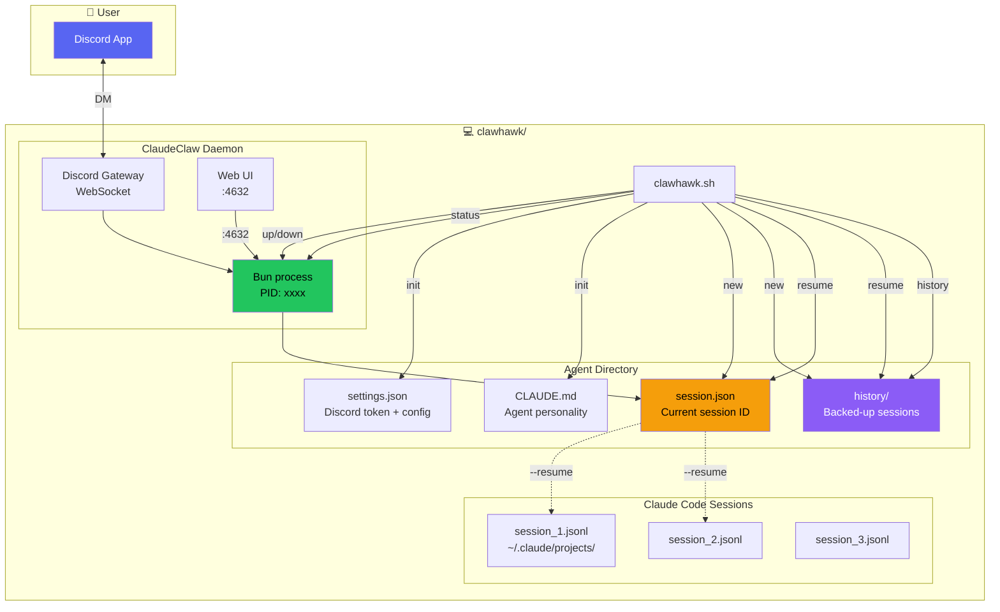
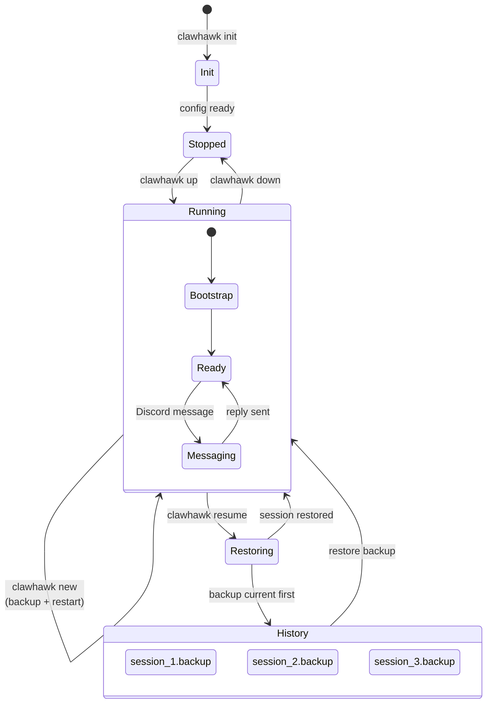

# ClawHawk — Single-Agent Session Manager

> **Status:** v1.0 Design  
> **Root:** `D:/project/claudeclaw`  
> **Target:** GitHub open-source — the simplest way to run a persistent Claude Code agent with Discord access

---

## 1. Overview

**ClawHawk** wraps ClaudeClaw into a single command. One agent, one directory, one bot — with full control over its conversation sessions.

The problem it solves: ClaudeClaw works, but you need to manually create directories, write settings.json, manage sessions, and remember UUIDs. ClawHawk makes it one command.

### What it does

```
clawhawk init          → 一键初始化，创建 agent 目录 + 配置 Discord
clawhawk up            → 启动守护进程，连接 Discord
clawhawk down          → 停止守护进程
clawhawk new           → 开启新会话（备份旧会话，从空白开始）
clawhawk resume <id>   → 恢复到指定历史会话
clawhawk history       → 列出所有历史会话，可交互选择
clawhawk status        → 查看当前状态
```

### What it does NOT do (yet)

- ❌ Multi-agent orchestration — 那是 v2 的事
- ❌ Agent-to-agent file communication
- ❌ Shared memory between agents
- ❌ Agent lifecycle for sub-agents

---

## 2. Architecture



---

## 3. Bot Naming Convention

Agent 启动时自动将 Discord 机器人名称改为：

```
Claude_Code_<父目录>/<当前目录>
```

### 命名规则

| 路径 | Bot 名称 | 长度 |
|------|----------|------|
| `agents/manager/` | `Claude_Code_agents/manager` | 28 ✅ |
| `agents/architect/` | `Claude_Code_agents/architect` | 30 ✅ |
| `bot-dev/` | `Claude_Code_bot-dev` | 21 ✅ |
| `security-auditor/` | `Claude_Code_security-auditor` | 30 ✅ |

**规则：**
- 前缀固定：`Claude_Code_` (12 chars)
- 路径取最后两级目录（当前目录 + 父目录）
- 根目录下的 agent 只取一级
- Discord 限制 32 字符，超出部分自动截断父目录名
- 非法字符（空格、中文等）替换为 `-`
- 名称冲突时追加数字后缀

### 自动行为

`clawhawk up` 启动时：
1. 根据项目路径自动计算 bot 名称
2. 调用 Discord API `PATCH /users/@me` 改名
3. 启动守护进程
4. Discord 中显示新名称

`clawhawk down` 停止时：不恢复名称（保持可识别）。

### 场景

```
多 agent 目录结构:
  /d/project/my-project/
  └── agents/
      ├── manager/      启动 → Bot 名: Claude_Code_agents/manager
      ├── architect/    启动 → Bot 名: Claude_Code_agents/architect
      ├── developer/    启动 → Bot 名: Claude_Code_agents/developer
      └── tester/       启动 → Bot 名: Claude_Code_agents/tester

Discord 里一眼可见:
  Claude_Code_agents/manager   🟢 在线
  Claude_Code_agents/developer 🟢 在线
  Claude_Code_agents/tester    ⚫ 离线
```

---

## 4. Project Layout

```
my-agent-project/                   ← 你的项目根目录
│
├── clawhawk.sh                      ← 唯一入口，所有功能在这一个文件
│
├── CLAUDE.md                        ← Agent 人格（由 init 生成）
│
├── .claude/
│   └── claudeclaw/
│       ├── settings.json            ← Discord bot + 会话配置
│       ├── session.json             ← { sessionId, createdAt, ... }
│       ├── daemon.pid               ← 当前守护进程 PID
│       ├── state.json               ← 运行时状态
│       └── history/                 ← 历史会话备份
│           ├── session_1.backup     ← 备份的 session.json
│           ├── session_2.backup
│           └── session_3.backup
│
└── docs/
    └── DESIGN.md                    ← 本设计文档
```

---

## 4. CLI Reference

### `clawhawk init`

```
初始化 agent 项目。幂等 — 已存在的文件不会覆盖。

$ clawhawk init [--name "Agent Name"] [--with-discord]

流程:
  1. 检查环境 (bun, node, git)
  2. 创建 .claude/claudeclaw/ 目录
  3. 写入 settings.json（默认值）
  4. 生成 CLAUDE.md 模板
  5. [可选] 交互式配置 Discord Bot Token
  6. 输出下一步提示
```

### `clawhawk up`

```
启动守护进程，自动重命名 Bot，连接 Discord。

$ clawhawk up [--web] [--port 4632] [--no-rename]

流程:
  1. 检查是否已在运行（PID 文件）
  2. 检查 Discord 配置完整性
  3. 根据目录路径计算 Bot 名称，调用 Discord API 改名
  4. 后台启动 Bun daemon
  5. 等待 Discord Ready 事件（最多 30s）
  6. 输出连接信息和 Web UI URL

Bot 命名规则:
  自动取路径最后两级目录: Claude_Code_<父目录>/<当前目录>
  例如: agents/manager → Claude_Code_agents/manager

--no-rename: 跳过自动改名，保留 Discord 中现有名称

如果已在运行: 输出当前 PID 和状态，不做任何操作。
如果端口冲突: 自动递增端口并重试。
```

### `clawhawk down`

```
停止守护进程，断开 Discord。

$ clawhawk down [--force]

流程:
  1. 读取 PID 文件
  2. 发送 SIGTERM
  3. 等待进程退出（最多 10s）
  4. 清理 PID 文件
  5. 输出确认

--force: SIGKILL 立即终止
```

### `clawhawk new`

```
开启全新对话。自动备份当前会话。

$ clawhawk new [--keep-backup] [--message "首条消息"]

流程:
  1. 如果当前有会话: 备份 session.json → history/session_N.backup
  2. 删除 session.json
  3. 如果守护进程在运行: restart（stop → 清理 → start）
  4. 守护进程启动后自动 bootstrap 创建新会话
  5. 输出新会话 ID 和备份位置

--keep-backup: 保留备份（默认行为）
--no-backup:   不备份，直接丢弃当前会话
```

### `clawhawk resume`

```
恢复到历史会话。

$ clawhawk resume [session-id] [--list]

流程:
  1. 如果带 --list: 显示所有历史会话，让用户选
  2. 如果带 session-id: 精确恢复到该会话
     - 需要 session-id 的前 8 位即可匹配
  3. 备份当前会话（如有）
  4. 将目标备份恢复到 session.json
  5. 重启守护进程（带 --resume session-id）

用法:
  clawhawk resume           → 交互式选择
  clawhawk resume a1b2c3d4  → 恢复到指定会话
  clawhawk resume --list    → 列出所有历史
```

### `clawhawk history`

```
查看历史会话列表。

$ clawhawk history [--detail] [--json]

输出:
  #   Session ID    Created             Messages    Note
  ─── ────────────  ──────────────────  ──────────  ─────
  1   a1b2c3d4e5f6  2026-06-15 14:30    42          login feature
  2   7g8h9i0j1k2l  2026-06-17 09:15    18          bug fixes
  3*  5m3n4o5p6q7r  2026-06-19 08:00    12          ← current

  * = current session

--detail: 显示每个会话的摘要（如果存在）
--json:   输出 JSON 格式
```

### `clawhawk rename`

```
手动设置 Discord Bot 显示名称。

$ clawhawk rename [name]

不带参数: 自动根据目录路径生成名称并应用
带参数:   使用指定的名称（限 32 字符）

流程:
  1. 读取 settings.json 获取 Bot Token
  2. 计算或使用指定的名称
  3. 调用 Discord API PATCH /users/@me
  4. 确认修改

Discord 限制:
  - 每小时最多改名 2 次
  - 名称最长 32 字符
  - 特殊字符会被 Discord 过滤

自动命名算法:
  path = /d/project/my-project/agents/developer
  → 取最后两级: agents/developer
  → 加前缀: Claude_Code_agents/developer
  → 检查长度: 30 chars ✅
  → 清理非法字符 → 发送 API
```

### `clawhawk status`

```
显示当前 agent 状态。

$ clawhawk status [--json]

输出:
  Agent Name:  MyAgent
  Status:      🟢 Running (PID: 12345)
  Discord:     ✅ Connected (MyClaude#1517...)
  Session:     5m3n4o5p... (12 turns, created 2h ago)
  Web UI:      http://127.0.0.1:4632
  Memory:      CLAUDE.md (1.2KB)
  History:     3 backed-up sessions
```

---

## 5. Session Lifecycle



---

## 6. How Sessions Work

### Where data lives

```
~/.claude/projects/<slug>/
├── a1b2c3d4-....jsonl    ← 实际对话内容（Claude Code 管理）
├── 7g8h9i0j-....jsonl
└── ...

./.claude/claudeclaw/
├── session.json          ← { sessionId: "a1b2c3d4-..." }
└── history/
    ├── session_1.backup   ← 旧 session.json 的副本
    └── session_2.backup
```

### How `new` works

```
1. Read session.json → { sessionId: "old-uuid", ... }
2. Copy to history/session_3.backup
3. Delete session.json
4. Restart daemon
5. Daemon bootstrap: no session.json → creates new session
6. New session.json written with new UUID
7. Claude Code creates new .jsonl in ~/.claude/projects/
```

### How `resume` works

```
1. User picks session_1.backup from history
2. Current session backed up (same as 'new')
3. session_1.backup copied to session.json
4. Daemon restarted with --resume <restored-uuid>
5. Claude Code loads existing .jsonl, continues conversation
```

---

## 7. Error Handling

| Error | Detection | Recovery |
|-------|-----------|----------|
| Agent already running | `daemon.pid` alive | 输出状态，不重复启动 |
| PID file stale (process dead) | `kill(pid, 0)` fails | 清理 PID，允许启动 |
| Discord token missing | `settings.json` has empty token | 提示运行 `clawhawk init --with-discord` |
| Discord gateway unreachable | No "Ready" within 30s | 超时提示，检查网络/VPN |
| Port conflict | `EADDRINUSE` | 自动 `port++` 重试 |
| No sessions to resume | `history/` empty | 提示无历史会话 |
| Session UUID not found | 8-char prefix no match | 列出所有可用会话 |
| Bun not installed | `which bun` empty | 自动 winget/npm 安装 |

---

## 8. Voice Design

```
$ clawhawk up
  ⏳ Starting agent...
  ✅ Discord connected — Ready as MyClaude#1517...
  📝 Session: a1b2c3d4 (resumed, 12 turns)
  🌐 Web UI: http://127.0.0.1:4632

  DM your bot: https://discord.com/users/1517184845208617170
```

```
$ clawhawk new
  💾 Backed up current session → history/session_3.backup
  🔄 Restarting daemon...
  ✨ New session: 5m3n4o5p
  Ready to go.
```

```
$ clawhawk history
  📋 Agent Sessions:

  #   ID         Date                  Turns   Note
  ─── ─────────  ────────────────────  ──────  ─────
  1   a1b2c3d4   Jun 15 14:30          42     login feature
  2   7g8h9i0j   Jun 17 09:15          18     bug fixes
  3*  5m3n4o5p   Jun 19 08:00          12     ← current

  Use 'clawhawk resume <id>' to switch.
```

```
$ clawhawk resume
  ? Which session? (use arrow keys)
  ❯ 1. a1b2c3d4  Jun 15  42 turns  login feature
    2. 7g8h9i0j  Jun 17  18 turns  bug fixes

  Selected: a1b2c3d4 - login feature
  💾 Backed up current → history/session_4.backup
  ↩  Restored a1b2c3d4
  🔄 Restarting daemon...
  ✅ Resumed — 42 turns of context restored.
```

---

## 9. Implementation

### File: `clawhawk.sh`

Single bash script (~400 lines). Self-contained. No dependencies beyond `bun`, `node`, and `jq` (optional for JSON parsing, falls back to grep).

**Structure:**
```bash
#!/usr/bin/env bash
set -e

# === Config ===
BUN_PATH="..."
CLAUDE_PLUGIN_ROOT="..."
AGENT_DIR="$(pwd)"
CLAUDE_CLAW_DIR="$AGENT_DIR/.claude/claudeclaw"

# === Helpers ===
check_env()       { ... }
read_session()    { ... }
write_session()   { ... }
backup_session()  { ... }
list_backups()    { ... }
find_daemon_pid() { ... }

# === Commands ===
cmd_init()        { ... }
cmd_up()          { ... }
cmd_down()        { ... }
cmd_new()         { ... }
cmd_resume()      { ... }
cmd_history()     { ... }
cmd_status()      { ... }

# === Main ===
case "${1:-}" in
  init)     shift; cmd_init "$@" ;;
  up)       shift; cmd_up "$@" ;;
  down)     shift; cmd_down "$@" ;;
  new)      shift; cmd_new "$@" ;;
  resume)   shift; cmd_resume "$@" ;;
  history)  shift; cmd_history "$@" ;;
  status)   shift; cmd_status "$@" ;;
  *)        show_help ;;
esac
```

---

## 10. v2 Roadmap (Future)

| Feature | Priority | Notes |
|---------|----------|-------|
| Session note/annotation | Low | `clawhawk note "login feature done"` |
| Session export (markdown) | Medium | `clawhawk export <id>` → `.md` file |
| Auto session rotation | Medium | Configure max turns, auto-new with summary |
| Multi-session view | Low | Compare two sessions side-by-side |
| Multi-agent orchestration | v2 | Separate design, builds on this |
